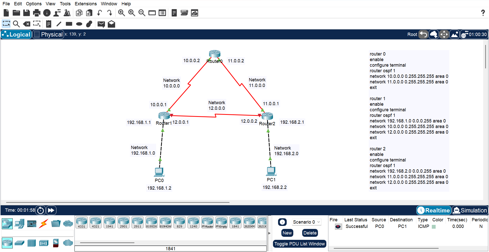

# 🔗 OSPF Multi-Router Topology (Cisco Packet Tracer)

## 📌 Project Overview
This project demonstrates the configuration of OSPF (Open Shortest Path First) routing protocol using Cisco Packet Tracer.

The network consists of 3 routers connected in a triangular topology with 2 LAN networks.

---

## 🧠 Concepts Used
- OSPF Routing Protocol
- Multi-router configuration
- IP Addressing & Subnetting
- Network Advertisement
- ICMP Testing (Ping)

---

## 🖥️ Topology



---

## ⚙️ Configuration

### Router 0
```bash
enable
configure terminal
router ospf 1
network 10.0.0.0 0.255.255.255 area 0
network 11.0.0.0 0.255.255.255 area 0
exit
```

### Router 1
```bash
enable
configure terminal
router ospf 1
network 192.168.1.0 0.0.0.255 area 0
network 10.0.0.0 0.255.255.255 area 0
network 12.0.0.0 0.255.255.255 area 0
exit
```

### Router 2
```bash
enable
configure terminal
router ospf 1
network 192.168.2.0 0.0.0.255 area 0
network 11.0.0.0 0.255.255.255 area 0
network 12.0.0.0 0.255.255.255 area 0
exit
```

---

## ✅ Output
- Successful ping between PC0 and PC1
- OSPF routes dynamically shared

---

## 📂 Files Included
- `ospf-multi-router-topology.pkt`
- `topology.png`

---

## 👨‍💻 Author
Arhan Hussain
